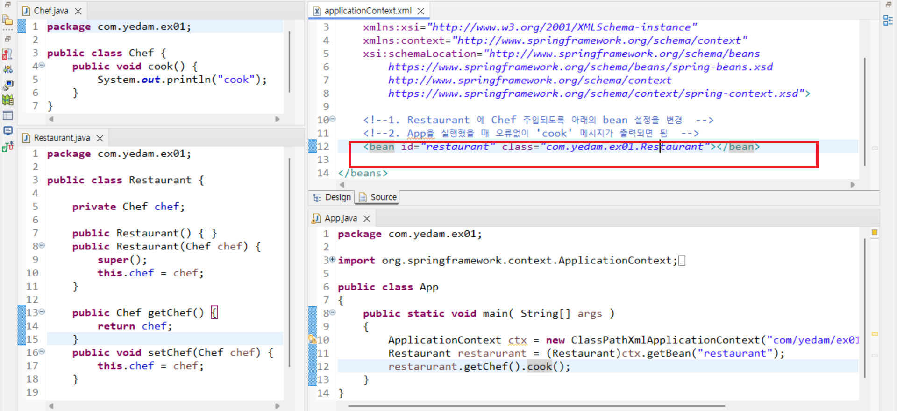
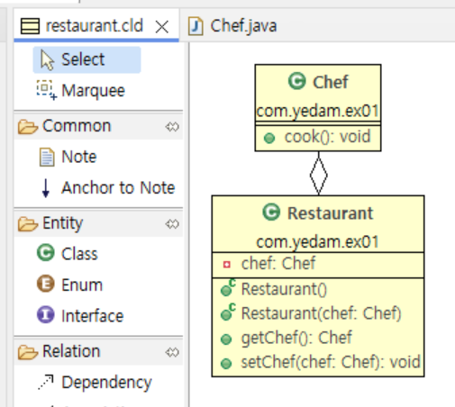

## 5월23일 주말과제입니다.
리포지토리를 다운받고 work02폴더를 이클립스에 import 한다음에 아래의 과제를 풀면 됩니다.
import -> maven project -> exiting project  -> work02 폴더 선택  
### 과제1 
`applicationContext.xml 파일 수정  `  
com.yedam.ex01 패키지에서 xml 기반 설정 문제입니다.   
applicationContext.xml 파일만 수정하고 App.java를 실행했을 때  'cook' 메시지가 출력되면 됨. 

### 과제2
`Ex02Configure.java  수정`   
com.yedam.ex02 패키지에서 Ex02Configure.java 설정파일에 Restaurant 클래스와 Chef 클래스를 빈으로 등록하고 App.java를 실행했을 때  'cook' 메시지가 출력되면 됨. 

### 과제3
`Restaurant 클래스와 Chef 클래스 수정`    
com.yedam.ex03 패키지에서는 component 스캔 설정이 되어 있습니다. Restaurant 클래스와 Chef 클래스에 애노테이션(롬복포함)을 사용하여 자동으로 빈 등록하고 주입받을수 있도록 설정합니다. 
App.java를 실행했을 때  'cook' 메시지가 출력되면 됨. 
